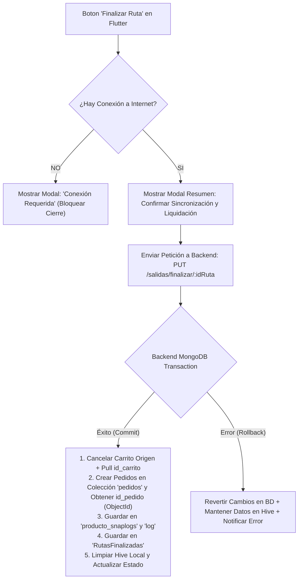

# Plan de Arquitectura y Flujo de Rutas: Web y Flutter

## 1. Resumen Ejecutivo y Diagnóstico del Estado Actual

Actualmente, la plataforma gestiona las ventas de ruta mediante un flujo distribuido entre la aplicación Web (`xenon`) y la aplicación móvil Flutter (`xenon-movil`).

### Formato de Identificadores (MongoDB `ObjectId`):
* **Tipado Estricto de IDs:** Todos los identificadores en el backend y en las respuestas API enviadas a Flutter (`_id`, `id_ruta`, `id_carrito_origen`, `id_pedido`, `id_cliente`, `id_usuario`) se manejan mediante el tipo nativo `mongoose.Types.ObjectId`.
* **Registro de `id_pedido` Generado:** Al finalizar la ruta, cada venta individual procesada crea un documento en la colección `pedidos` (`Pedido`) devolviendo su `ObjectId` nativo (`id_pedido`), el cual se guarda en la colección `RutasFinalizadas` y se retorna en la respuesta hacia la app móvil.

### Diferenciación de Colecciones y Control de Apartados (`Producto.carritos`):
* **`carritos` (`Carrito`):** Colección utilizada para cotizaciones y para almacenar el carrito maestro de salida a ruta (inventario inicial en la camioneta). Al agregar productos a este carrito, MongoDB registra un apartado en `Producto.carritos` con el par `{ id_carrito: ObjectId, cantidad }`.
* **`pedidos` (`Pedido`):** Colección oficial donde se registran las ventas definitivas y confirmadas realizadas a los clientes durante la ruta.
* **Solución al Bug de "Productos en el Limbo":** Al cancelar el carrito maestro de la ruta, el backend ejecuta un `$pull` de `{ id_carrito: id_carrito_maestro }` en la colección `productos`, **liberando el 100% de los apartados en el limbo**.

---

## 2. Modal de Advertencia y Reglas de Finalización de Ruta

> [!WARNING]
> **Regla de Negocio:** La finalización de ruta no se puede ejecutar en modo offline para garantizar que las ventas en campo, el arqueo de caja y el reingreso de inventario se confirmen inmediatamente en la base de datos central mediante una transacción atómica.



### Comportamiento del Modal en la App Móvil:
* **Si NO hay conexión (WiFi/Datos):**
  * Se muestra un `AlertDialog` emergente:
    * 📡 **Título:** *"Conexión a Internet Requerida"*
    * 📄 **Mensaje:** *"Para finalizar la ruta y sincronizar las ventas de campo con el servidor web, es necesario estar conectado a Internet (WiFi o datos móviles). Por favor, conéctate a una red para procesar el cierre."*
    * 🔴 **Acción:** Botón *"Entendido"* (no permite avanzar).
* **Si SÍ hay conexión:**
  * Se muestra un modal de confirmación con el resumen de la jornada:
    * 🛒 *"Ventas realizadas: X pedidos"*
    * 💰 *"Monto total acumulado: $XX,XXX.XX MXN"*
    * 🟢 **Acciones:** *"Confirmar y Sincronizar"* / *"Cancelar"*.

---

## 3. Solución a los Problemas con la Colección `RutasFinalizadas`

> [!IMPORTANT]
> **Dictamen:** **ALTAMENTE RECOMENDADO.** 
> Implementar la nueva colección `rutas_finalizadas` resuelve de raíz los problemas de **Conciliación de Inventario**, **Desconexión en Liquidación Financiera**, **Trazabilidad Dispersa** y **Limpieza de Apartados en el Limbo**, concentrando toda la información del cierre en un único registro inmutable.

### ¿Cómo `RutasFinalizadas` resuelve cada punto?

1. **Conciliación de Inventario y Eliminación de Apartados Fantasma:**
   * Registra el stock inicial cargado, el stock vendido en campo y el stock sobrante devuelto al almacén.
   * Al finalizar la ruta con conexión, el backend marca el carrito maestro de la ruta en `carritos` como `status: 'Cancelado'` y remueve la entrada `{ id_carrito: id_carrito_maestro }` de `Producto.carritos`, **eliminando completamente los apartados en el limbo**.

2. **Liquidación Financiera (Corte de Caja):**
   * Registra el arqueo de caja dividiendo lo cobrado en:
     * Total cobrado en **Efectivo** (dinero físico para entrega en caja).
     * Total en **Transferencias** (verificable con banco).
     * Total a **Crédito** (preparado para cuentas por cobrar futuras).

3. **Trazabilidad Única (Registro de `id_pedido` nativo MongoDB):**
   * Cada venta individual generada obtiene su `id_pedido` (`ObjectId` nativo de la colección `pedidos`).
   * `RutasFinalizadas` guarda el arreglo completo de estos identificadores: `pedidos_generados: [{ type: Schema.Types.ObjectId, ref: 'Pedido' }]`.

---

## 4. Esquema Propuesto para `RutasFinalizadas` (Mongoose)

Se aplica el tipado estricto con `Schema.Types.ObjectId` en todas las referencias del modelo.

```javascript
// models/rutas_finalizadas.js
import mongoose from 'mongoose';
const Schema = mongoose.Schema;

const schema = new Schema({
    // Referencias principales (Tipadas estricta como ObjectId)
    id_salida: { type: Schema.Types.ObjectId, ref: 'SalidasVentas', required: true },
    id_carrito_origen: { type: Schema.Types.ObjectId, ref: 'Carrito', required: true }, // Carrito maestro cancelado (liberando id_carrito)
    id_ruta: { type: Schema.Types.ObjectId, ref: 'Rutas', required: true },
    nombre_ruta: { type: String, required: true },
    folio_salida: { type: String, required: true },
    
    // Agente / Usuario responsable
    agente: {
        id: { type: Schema.Types.ObjectId, ref: 'Usuario', required: true },
        nombre: { type: String, default: "" },
        correo: { type: String, default: "" }
    },
    
    // Fechas de la operación
    fecha_salida: { type: Date, required: true },
    fecha_finalizacion: { type: Date, default: Date.now },

    // Conciliación de Inventario (Por producto)
    inventario_conciliacion: [
        {
            producto: {
                id: { type: Schema.Types.ObjectId, ref: 'Producto', required: true },
                nombre: { type: String },
                codigo: { type: String },
                precio: { type: Number }
            },
            cantidad_cargada: { type: Number, default: 0 },   // Stock inicial cargado
            cantidad_vendida: { type: Number, default: 0 },   // Stock total vendido
            cantidad_devuelta: { type: Number, default: 0 },  // Stock devuelto al almacén
            diferencia: { type: Number, default: 0 }          // Faltantes o mermas
        }
    ],

    // Resumen Financiero y Arqueo de Caja (Incluye preparación para crédito futuro)
    totales_financieros: {
        total_cargado_estimado: { type: Number, default: 0 },
        total_vendido: { type: Number, default: 0 },
        desglose_pagos: {
            efectivo: { type: Number, default: 0 },
            transferencia: { type: Number, default: 0 },
            credito: { type: Number, default: 0 }  // 👈 Preparado para ventas a crédito futuras
        }
    },

    // Arreglo explícito de IDs de la colección PEDIDOS (ObjectId)
    pedidos_generados: [{ type: Schema.Types.ObjectId, ref: 'Pedido' }],

    // Observaciones o notas del cierre
    notas_cierre: { type: String, default: "" },
    estatus_conciliacion: { type: String, enum: ['Correcto', 'Con Faltantes', 'Revisado'], default: 'Correcto' }
});

export var RutasFinalizadas = mongoose.model('RutasFinalizadas', schema);
```

---

## 5. Propuestas de Mejora y Optimizaciones Destacadas

> [!IMPORTANT]
> **Mejora 1: Transacciones ACID y Rollbacks Atómicos en Backend (MongoDB)**
> Para garantizar la máxima coherencia de datos, la finalización de la ruta en el servidor se ejecuta dentro de una **Transacción de MongoDB (`session.startTransaction()`)**:
> - Se procesa la cancelación del carrito maestro en `carritos` liberando el `id_carrito` en `Producto.carritos`.
> - Se insertan las ventas en la colección `pedidos` obteniendo su `id_pedido` (`ObjectId`).
> - Se guardan los registros de auditoría de inventario en `producto_snaplogs` y `log` referenciando el `id_pedido`.
> - Se descuenta la existencia física real en `Producto.existencia.actual`.
> - Se crea el documento consolidado en `RutasFinalizadas` enlazando `pedidos_generados`.
> - **Si ocurre cualquier error**, se invoca `session.abortTransaction()` (**Rollback**).

> [!TIP]
> **Mejora 2: Garantía de Formato `ObjectId` en Respuestas API**
> Validar con `mongoose.Types.ObjectId.isValid()` todos los IDs enviados desde Flutter o la Web antes de consultar la base de datos, convirtiendo cadenas de 24 caracteres en `ObjectId` nativos para prevenir fallas de casteo.

> [!TIP]
> **Mejora 3: Persistencia en MongoDB de los Snaplogs Generados por Flutter**
> Aprovechar los logs que Flutter genera en Hive (`logsSnapProducto`) e insertarlos en la colección `producto_snaplogs` durante el cierre de ruta referenciando el `id_pedido` recién creado.

> [!TIP]
> **Mejora 4: Limpieza Definitiva de Apartados "En el Limbo" por `id_carrito`**
> Al cancelar el carrito maestro de la ruta, el backend ejecuta una actualización directa en la colección `Producto`:
> ```javascript
> await Producto.updateMany(
>     { "carritos.id_carrito": id_carrito_maestro },
>     { $pull: { carritos: { id_carrito: id_carrito_maestro } } }
> );
> ```

> [!TIP]
> **Mejora 5: Protección Transaccional en App Móvil (Hive Idempotencia)**
> Las ventas locales guardadas en Hive **nunca se borran del teléfono** hasta recibir una respuesta afirmativa `200 OK` (`{ ok: true }`) enviada tras un `commit` exitoso del servidor con la lista de `id_pedido` creados.

---

## 6. Plan de Implementación Paso a Paso

### Fase 1: Backend Web (`xenon`)
1. Crear el modelo `RutasFinalizadas` en `src/models/rutas_finalizadas.js` asegurando el tipo `Schema.Types.ObjectId` en todas sus referencias.
2. Actualizar el endpoint `PUT /salidas/finalizar/:idRuta` implementando **MongoDB Transactions (`startTransaction` / `abortTransaction`)**:
   - *Inicia Sesión MongoDB (`session`).*
   - Cambiar estatus del `Carrito` maestro en `carritos` a `'Cancelado'`.
   - Ejecutar `$pull` en `Producto.carritos` utilizando `id_carrito_maestro` (`ObjectId`) para **eliminar apartados en el limbo**.
   - Crear y guardar cada documento en la colección `pedidos` (`Pedido`), obteniendo su `_id` nativo (`id_pedido`).
   - Insertar los registros de auditoría de inventario en `producto_snaplogs` (`Producto_snaplog`) vinculando `id_pedido`.
   - Actualizar existencias reales en `Producto.existencia.actual`.
   - Guardar el documento consolidado en `RutasFinalizadas` asociando el arreglo `pedidos_generados` con los `id_pedido` (`ObjectId`).
   - Marcar `SalidasVentas` como `'Finalizada'`.
   - *Si todo es exitoso -> `commitTransaction()`. Retornar `{ ok: true, pedidos_creados: [...] }` con sus `id_pedido`.*
3. Crear endpoint `GET /salidas/historial-rutas` para consultar las rutas finalizadas con sus pedidos vinculados.

### Fase 2: Frontend Web (`xenon`)
1. En la vista de pedidos de ruta, inhabilitar la edición de productos cuando el carrito maestro esté `'En Ruta'`.
2. Añadir vista de "Historial de Rutas Finalizadas" mostrando la lista de ventas de la colección `pedidos` asociadas por su `id_pedido`.

### Fase 3: App Móvil Flutter (`xenon-movil`)
1. Garantizar la captura de ventas offline sin generar excepciones ni bloqueos, asegurando la creación de `logsSnapProducto` en Hive.
2. En `Clients` / `VentasRutaScreen`, integrar la validación de conectividad previa a la finalización de ruta:
   - Si no hay conexión -> Mostrar Modal emergente de advertencia y detener proceso.
   - Si hay conexión -> Mostrar Modal de confirmación con resumen de ventas e iniciar sincronización.
3. Al recibir confirmación exitosa `200 OK` del servidor (con la confirmación de los `id_pedido` generados), borrar las ventas de Hive local y redirigir al Home.
