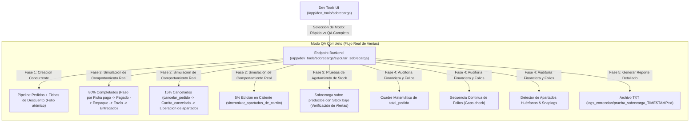

# Plan de Implementación Ampliado: Suite de Pruebas QA y Sobrecarga de Ventas

Ampliaremos la funcionalidad de la herramienta de sobrecarga en **Dev Tools** agregando el modo **QA Completo (Flujo Real de Ventas)**, el cual simulará el comportamiento dinámico de producción en tiempo real: cancelaciones masivas, ediciones de pedidos en caliente, paso por los estados intermedios del flujo de ventas (`Pedido` ➔ `Ficha pago` ➔ `Pagado` ➔ `Empaque` ➔ `Envío` ➔ `Entregado`), auditoría contable de `total_pedido`, prueba de agotamiento de stock (*Out of Stock*) y verificación de secuencia continua de folios sin huecos.

---

## 📋 Arquitectura y Flujo de Pruebas QA Ampliado

---

## 🚀 Cambios Propuestos

### 1. Extensión del Componente Backend (`ejecutar_sobrecarga.js`) [MODIFY]
- **Soporte para Modos de Prueba:**
  - `modo: "rapido"`: Transición directa a Envío y Entregado (comportamiento actual).
  - `modo: "qa_completo"`: Simulación completa del ciclo de ventas de producción.
- **Implementación del Modo QA Completo:**
  - **Fase 1: Creación Concurrente con Fichas de Descuento**:
    - Crea pedidos e integra de forma aleatoria `Ficha_de_descuento` temporales para verificar su consumo y eliminación automática.
  - **Fase 2: Cadena Completa de Estados y Acciones Mixtas**:
    - **Paso por Estados Intermedios**: `Pedido` ➔ `Ficha pago` ➔ `Pagado` ➔ `Empaque` ➔ `Envío` ➔ `Entregado`.
    - **15% Cancelados Simultáneamente**: Ejecuta `cancelar_pedido()`, verificando que la reserva se remueva del producto y se mueva a `Carrito_cancelado` sin descontar existencias físicas.
    - **5% Ediciones en Caliente**: Modifica la lista de productos y cantidades antes de confirmarse.
  - **Fase 3: Stress de Stock Insuficiente (*Out of Stock*)**:
    - Genera peticiones sobre productos con existencias cercanas a 0 para corroborar la prevención de stock negativo.
  - **Fase 4: Auditoría Financiera y de Folios Secuenciales**:
    - Recorre cada pedido creado y verifica que `total_pedido` cuadre exactamente con la suma de precios menos descuentos.
    - Analiza la lista ordenada de folios asignados (`#29125`, `#29126`, ...) y alerta si existe cualquier hueco (*gap*) en la secuencia.
    - Ejecuta `detectar_apartados_huerfanos()`.
  - **Fase 5: Reporte `.txt` QA Ampliado**:
    - Incluye métricas de pedidos entregados, cancelados, editados, auditoría de cuadre financiero y análisis de secuencia de folios.

---

### 2. Extensión del Componente Frontend (`index.svelte`) [MODIFY]
- **Selector de Modo en la UI**:
  - Radio buttons o desplegable: **Modo Rápido** vs **Modo QA Completo (Flujo Real de Ventas)**.
- **Nuevas Métricas en la Pantalla**:
  - *Pedidos Cancelados*
  - *Cuadre Financiero* (OK / Diferencia)
  - *Secuencia de Folios* (Sin huecos / Huecos detectados)
- **Modal de Progreso Ajustado**:
  - Visualización del avance por las fases del modo QA completo.
  - Botón de descarga de reporte `.txt`.

---

## 🔍 Plan de Verificación

### Pruebas Automatizadas e Integración:
1. Ejecutar el script en **Modo QA Completo** con 1,000 pedidos.
2. Verificar que las cancelaciones simultáneas liberan apartados correctamente sin afectar existencias.
3. Confirmar que los pedidos entregados descontaron el inventario de forma atómica.
4. Validar el cuadre del 100% de los `total_pedido` y la ausencia de huecos en los folios.
5. Confirmar que el detector de apartados huérfanos reporte **0 huérfanos**.
6. Descargar el reporte `.txt` completo y verificar los bloques de auditoría financiera y de folios.
