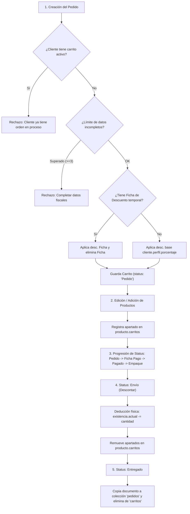

# Análisis a Profundidad: Flujo de Pedidos, Colecciones y Permisos por Rol

Este documento contiene el análisis técnico detallado sobre el funcionamiento del módulo de pedidos en la plataforma Xenón, incluyendo la interacción entre colecciones de la base de datos, el cálculo de descuentos, la reserva y descuento de inventario, el ciclo de vida de los estados del pedido y las restricciones por rol existentes.

---

## 1. Estructura y Arquitectura de Colecciones de Datos

El módulo de pedidos utiliza tres colecciones principales en MongoDB para gestionar el ciclo de vida de una orden, además de interactuar directamente con la colección de productos para el apartado de existencias.

```
 [Colección: carritos]        [Colección: productos]       [Colección: pedidos]
  (Órdenes Activas)            (Apartado & Stock)           (Órdenes Entregadas)
+-------------------+        +--------------------+        +-------------------+
| status:           |        | existencia.actual  |        | status: 'Enviado' |
| - Pedido          |        | carritos: [        |        |   o 'Entregado'   |
| - Ficha Pago      | -----> |   { cliente,       | -----> |                   |
| - Pagado          |        |     cantidad }     |        | fecha_entregado:  |
| - Empaque         |        | ]                  |        |   Date.now()      |
| - Envío           |        +--------------------+        +-------------------+
+-------------------+
          |
          v (Al cancelar)
+-----------------------+
| carritos_cancelados   |
| (Histórico cancelados)|
+-----------------------+
```

### Detalle de Colecciones:
1. **`carritos` (Modelo `Carrito` - [src/models/carrito.js](file:///home/ghostpredator/Repos/xenon/src/models/carrito.js)):**
   - Alberga todas las órdenes de venta activas desde su creación hasta la etapa de envío.
   - Maneja los estados: `'Pedido'`, `'Ficha Pago'`, `'Pagado'`, `'Empaque'` y `'Envío'`.
2. **`pedidos` (Modelo `Pedido` - [src/models/pedido.js](file:///home/ghostpredator/Repos/xenon/src/models/pedido.js)):**
   - Colección histórica exclusiva de órdenes **finalizadas y entregadas**.
   - Solo almacena registros cuyo estado es `'Entregado'` / `'Enviado'`.
3. **`carritos_cancelados` (Modelo `Carrito_cancelado` - [src/models/carrito_cancelado.js](file:///home/ghostpredator/Repos/xenon/src/models/carrito_cancelado.js)):**
   - Colección de respaldo donde se trasladan los carritos que son cancelados antes de la fase de descuento físico de inventario.
4. **`productos` (Modelo `Producto` - [src/models/producto.js](file:///home/ghostpredator/Repos/xenon/src/models/producto.js)):**
   - Almacena el inventario físico (`existencia.actual`).
   - Contiene el arreglo `carritos: [{ cliente: { id }, cantidad }]` que representa las piezas reservadas temporalmente por órdenes activas.

---

## 2. Flujo Paso a Paso: Desde la Creación hasta la Entrega



### Paso 1: Creación del Pedido (`crear_pedido_nuevo_v2.js`)
- **Restricción de Orden Única:** Ejecuta `tiene_carrito()`. Un cliente solo puede tener **un pedido activo** simultáneamente en `carritos` (en estados `Pedido`, `Ficha pago`, `Pagado` o `Empaque`).
- **Validación de Datos Fiscales:** Revalida en el servidor que el cliente no supere el límite permitido (máximo 3 cotizaciones con datos fiscales incompletos).
- **Asignación de Folio Autoincrementable:** Obtiene el valor máximo entre las colecciones `carritos` y `pedidos` para asignar el folio numérico único.

### Paso 2: Evaluación de Descuentos por Cliente
- **Ficha de Descuento Temporal (`Ficha_de_descuento`):** Si existe una ficha temporal activa para el cliente (`tenia_ficha = true`), toma dicho porcentaje para la orden y elimina la ficha de la base de datos inmediatamente.
- **Descuento Base (`cliente.perfil.porcentaje`):** Si no hay ficha temporal, aplica el porcentaje de descuento configurado de forma permanente en el perfil o porcentaje del cliente.

### Paso 3: Apartado de Inventario y Cálculo de Existencias
- Al añadir productos a la orden, la cantidad se registra en el arreglo `carritos` del producto:
  $$\text{Total Reservado} = \sum \text{cantidad en } \text{producto.carritos}$$
  $$\text{Disponibilidad Real} = \text{existencia.actual} - \text{Total Reservado}$$
- Se admite la configuración de piezas MasterBox (`canMB`) y asignación de folios/números de serie por ítem.

---

## 3. Ciclo de Vida de los 6 Estados del Pedido

| # | Estado | Ubicación en BD | Acción Principal / Afectación en Sistema |
| :---: | :--- | :--- | :--- |
| **1** | **`Pedido`** | `carritos` | Orden creada en borrador. Aparta productos en `producto.carritos`. |
| **2** | **`Ficha Pago`** | `carritos` | Espera o carga de comprobante de transferencia/depósito bancario. |
| **3** | **`Pagado`** | `carritos` | Validación y confirmación del pago por parte de administración o finanzas. |
| **4** | **`Empaque`** | `carritos` | Almacén prepara el paquete físicamente. |
| **5** | **`Envío (Descontar)`** | `carritos` | **Punto Crítico:** Descuenta existencias físicas (`existencia.actual -= cantidad`), remueve apartados, permite agregar costo de paquetería por defecto y genera logs/snaps de auditoría. |
| **6** | **`Entregado`** | `pedidos` | **Cierre del Pedido:** Se clona la orden a la colección **`pedidos`** (con `fecha_entregado`) y se borra de la colección **`carritos`**. |

---

## 4. Matriz de Permisos y Restricciones por Rol

### A. Restricciones en la Interfaz de Usuario (Frontend)

- **Apertura de Modal de Cambio de Status (`Row.svelte` -> `_Cambio_status.svelte`):**
  - **Solo Administrador:** Únicamente los usuarios con `$usuario_db.rol == "administrador"` pueden ver e interactuar con el botón para cambiar el estado del pedido.
  - Vendedores, almacén y logística ven la píldora del status como texto plano sin interacción.

- **Cancelación de Pedidos (`Row.svelte`):**
  - **Oculto para Almacén:** El botón de cancelar está oculto si `$usuario_db.rol == "almacen"`.
  - **Bloqueo por Estado:** No se permite cancelar si el pedido se encuentra en estado `Envío` (debido a que el stock físico ya fue deducido).

- **Modificación de Descuentos en Órdenes Existentes (`Nuevo_Descuento.svelte`):**
  - Restringido a `$usuario_db.rol === "administrador"` o `$usuario_db.rol === "gerente"`.

- **Edición de Contenido del Pedido (`Paso_2.svelte`):**
  - El rol `almacen` tiene inhabilitada la edición de cantidades, precios y eliminación de productos (`disabled={$usuario_db.rol == "almacen"}`).

### B. Restricciones en el Servidor (Backend APIs)

| Endpoint | Archivo Servidor | Validación Actual | Brecha / Estado |
| :--- | :--- | :--- | :--- |
| `/app/pedidos/cambiar_status` | [cambiar_status.js](file:///home/ghostpredator/Repos/xenon/src/routes/app/pedidos/cambiar_status.js) | `accesos.esta_logueado(req)` | **Sin filtro de rol en servidor.** Depende del frontend. |
| `/app/pedidos/cambiar_status_a_envio` | [cambiar_status_a_envio.js](file:///home/ghostpredator/Repos/xenon/src/routes/app/pedidos/cambiar_status_a_envio.js) | `accesos.esta_logueado(req)` | **Sin filtro de rol en servidor.** |
| `/app/pedidos/cambiar_status_a_enviado` | [cambiar_status_a_enviado.js](file:///home/ghostpredator/Repos/xenon/src/routes/app/pedidos/cambiar_status_a_enviado.js) | `accesos.esta_logueado(req)` | **Sin filtro de rol en servidor.** |
| `/app/pedidos/cancelar_carrito` | [cancelar_carrito.js](file:///home/ghostpredator/Repos/xenon/src/routes/app/pedidos/cancelar_carrito.js) | `accesos.esta_logueado(req)` | **Sin filtro de rol en servidor.** |

---

## 5. Recomendaciones para la Reestructuración de Status por Rol

1. **Definir la Matriz de Transiciones Permitidas por Rol:**
   - **Vendedor / Comercial:** Creación (`Pedido`) y carga de comprobante (`Ficha Pago`).
   - **Administración / Cobranza:** Validación de pago (`Pagado`).
   - **Almacén:** Preparación de paquete (`Empaque`).
   - **Logística / Embarques:** Autorización de despacho (`Envío`), activando el descuento físico de inventario.
   - **Administrador / Gerente:** Autorización global de cualquier cambio de estado y cancelación.

2. **Fortalecer la Seguridad Backend:**
   - Incorporar en los endpoints de cambio de status las funciones helper existentes en `accesos.js` (como `tiene_permisos_administrativos(req)`, `tiene_permisos_gerenciales(req)` o crear helpers específicos por área) para evitar que peticiones HTTP directas puedan alterar los estados sin el rol adecuado.
