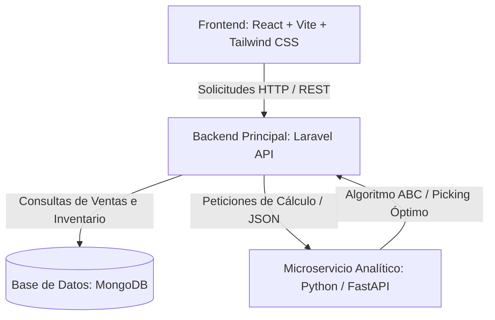

# Plan de Desarrollo e Investigación: Software de Automatización de Bodega (WMS)

Este documento detalla el análisis funcional, alcance, arquitectura propuesta y hoja de ruta para la implementación de un Software de Automatización de Bodega (WMS - Warehouse Management System). El sistema optimiza la distribución del inventario dentro del almacén basándose en datos históricos de ventas, rotación de productos y características físicas, integrándose con el ecosistema actual de Xenón.

---

## 📈 1. Análisis de Ventas y Métricas de Rotación

Para lograr una organización inteligente del almacén, el sistema procesará la información histórica analizando los siguientes indicadores:

1. **Clasificación ABC (Análisis de Pareto):**
   * **Clase A (Alta Rotación):** El ~20% de los productos que representan el ~80% de las salidas. Deben ubicarse en las zonas más accesibles de la bodega (cerca del área de empaque/despacho).
   * **Clase B (Rotación Media):** El ~30% de los productos que representan el ~15% de las salidas. Ubicados en pasillos intermedios.
   * **Clase C (Baja Rotación):** El ~50% de los productos que representan el ~5% de las salidas. Ubicados en las zonas más profundas o de difícil acceso (niveles altos de estantería).
2. **Frecuencia de Salida (Velocity):** Número de pedidos en los que aparece el producto en un periodo determinado (independientemente de las unidades solicitadas).
3. **Volumen de Desplazamiento (Cubaje):** Espacio físico total (unidades × dimensiones del empaque) desplazado en un periodo de tiempo.
4. **Estacionalidad y Tendencias:** Identificación de incrementos periódicos de demanda para proponer pre-posicionamiento temporal (ej. productos con alta venta en invierno).

---

## 🏢 2. Organización Inteligente y Algoritmos de Distribución

El sistema sugerirá ubicaciones de almacenamiento físicas (Pasillo, Estante, Nivel) minimizando los costos operativos de traslado del personal mediante:

1. **Optimización de Rutas de Surtido (Picking List):**
   * Ordenamiento dinámico de las partidas de un pedido usando algoritmos de ruta óptima (como Heurística del Vecino Más Cercano o Algoritmo de Pasillo Transversal) para evitar que el surtidor regrese por pasillos ya recorridos.
2. **Agrupación Logística de Productos:**
   * **Familias de Productos:** Mantener categorías similares juntas para facilitar la velocidad de picking.
   * **Restricciones Físicas:** Consideración de peso (cajas pesadas en niveles inferiores) y volumen (dimensiones del producto vs volumen del estante).

---

## 🛠️ 3. Arquitectura del Sistema Propuesta (React + Laravel + Python)

Para garantizar un diseño modular, dinámico y desacoplado de la interfaz actual en Svelte, proponemos una arquitectura basada en microservicios y APIs REST utilizando **Laravel** como backend principal y **Python** para el procesamiento de algoritmos complejos.



### Componentes Tecnológicos Propuestos:
1. **Frontend:** **React** + **Vite** + **Tailwind CSS**. Una interfaz interactiva con bibliotecas como React Flow o Three.js para mapear la bodega en 2D/3D, y Recharts para visualizar métricas.
2. **Backend Principal (API & Lógica):** **Laravel (PHP 8.x)**.
   * Administra la autenticación (Laravel Sanctum), autorización de accesos de usuarios, endpoints REST, persistencia de datos (usando `mongodb/laravel-mongodb` para conectar a la misma base de datos de Xenón) y colas de trabajo para tareas largas.
3. **Motor Analítico (Cálculos y Optimización):** **Python (FastAPI o Flask)**.
   * Se comunica con Laravel mediante una API interna síncrona o asíncrona. Python recibe la información estructurada de ventas y ubicaciones, y procesa la clasificación ABC, mapeo de estacionalidad, y la resolución del algoritmo de rutas de surtido (picking).
4. **Base de Datos:** **MongoDB**. Permite almacenar la colección de mapeo de bodegas y coexistir de forma directa con los esquemas de Xenón.

---

## 🔗 4. Integración con el Sistema Actual (Modelos de Xenón)

El nuevo módulo de automatización de bodega consumirá y complementará los datos de la base de datos de Xenón a través de los siguientes modelos:

1. **Historial de Ventas:**
   * Consumo del modelo [pedido.js](file:///home/ghostpredator/Repos/xenon/src/models/pedido.js) para calcular la rotación, frecuencia y estacionalidad de productos.
2. **Control de Inventarios:**
   * Lectura del modelo [producto.js](file:///home/ghostpredator/Repos/xenon/src/models/producto.js) para extraer descripciones, existencias, folios de inventario y datos de `masterBox`.
3. **Mapeo de Bodega:**
   * Creación del esquema `Ubicacion` asociado a cada producto en [producto.js](file:///home/ghostpredator/Repos/xenon/src/models/producto.js):
     ```javascript
     ubicacion: {
         pasillo: { type: String, default: '' },
         estante: { type: String, default: '' },
         nivel: { type: Number, default: 0 }
     }
     ```
4. **Registro de Entradas y Recepción:**
   * Integración con [pedimento.js](file:///home/ghostpredator/Repos/xenon/src/models/pedimento.js) e [inyeccion.js](file:///home/ghostpredator/Repos/xenon/src/models/inyeccion.js). Al arribar un contenedor, el sistema WMS sugerirá automáticamente las ubicaciones óptimas vacías para inyectar la mercancía recién llegada.

---

## 🚀 5. Definición del Alcance (MVP vs Futuro)

### MVP (Producto Mínimo Viable)
* **Visualización de Mapeo de Bodega:** Panel 2D plano para visualizar estanterías, pasillos y qué producto está en cada sección.
* **Clasificación ABC Manual/Semicontinua:** Procesamiento batch bajo demanda que clasifica los productos según las ventas de los últimos 30/90 días y emite alertas de reubicación sugeridas.
* **Picking List Ordenado:** Generación de hojas de surtido ordenadas por pasillo/estante de origen para agilizar el trabajo en almacén.
* **Integración de Ubicaciones en Productos:** Campo de coordenadas en el registro de productos de Xenón.

### Etapas Futuras
* **Reorganización Dinámica Dinámica:** Algoritmos en tiempo real que reconfiguran el mapa de la bodega al cambiar tendencias semanales o estacionales.
* **Simulación en Tiempo Real:** Comparador visual del impacto de traslados en tiempos de picking antes de realizar la reorganización física de la bodega.
* **Ruteo 3D de Picking:** Rutas gráficas en 3D para dispositivos móviles de los operadores de almacén.

---

## 📅 6. Plan de Desarrollo y Fases

### Fase 1: Análisis Funcional y Diseño de Datos (Semanas 1 - 2)
* Definición formal de coordenadas de bodega y diseño del subesquema de ubicaciones en MongoDB.
* Modelado del flujo de picking (surtido físico).

### Fase 2: Configuración de Arquitectura y API Backend (Semanas 3 - 5)
* Inicialización del frontend en **React + Vite** y Setup del servidor de optimización en **Python/FastAPI**.
* Implementación de la API de integración con Xenón para la extracción histórica de pedidos e inventarios.

### Fase 3: Algoritmos de Clasificación ABC y Rutas (Semanas 6 - 8)
* Desarrollo del motor de procesamiento analítico ABC y del algoritmo de ordenamiento de rutas de picking.
* Pruebas de velocidad de consulta en base a lotes grandes de pedidos.

### Fase 4: Desarrollo de Interfaz de Bodega y Reportes (Semanas 9 - 11)
* Panel interactivo en React para la bodega, mapas de calor de rotación y visualización del almacén.
* Integración del módulo de descargas y picking list optimizado.

### Fase 5: Pruebas y Despliegue (Semanas 12 - 13)
* Simulación de carga real de pedidos en producción y medición de tiempos de picking comparativos.
* Lanzamiento del MVP.

---

## ✅ 7. Criterios de Aceptación

1. **Reducción de Tiempos de Picking:** La ruta generada por el sistema para surtir un pedido con más de 3 productos distintos debe reducir los pasillos recorridos en al menos un 25% frente a un surtido sin optimizar.
2. **Clasificación Correcta:** Los productos de la clase A (alta rotación) deben asignarse y reubicarse en las cabeceras de pasillos o zonas adyacentes al área de empaque.
3. **Consistencia de Inventario:** La reubicación sugerida no debe duplicar coordenadas ocupadas ni exceder la capacidad física (`masterBox` / volumen) parametrizada para el estante.
4. **Desacoplamiento Tecnológico:** El módulo debe correr de forma independiente al código Svelte de Xenón, consumiendo únicamente los datos de base de datos compartida o a través de APIs REST.

---

## 🖼️ 8. Prototipo de Interfaces Propuestas (Mockups)

Para ilustrar la funcionalidad y experiencia de usuario planteada para el frontend en React, se proponen los siguientes diseños de interfaz:

```carousel

<!-- slide -->

<!-- slide -->

<!-- slide -->

```
